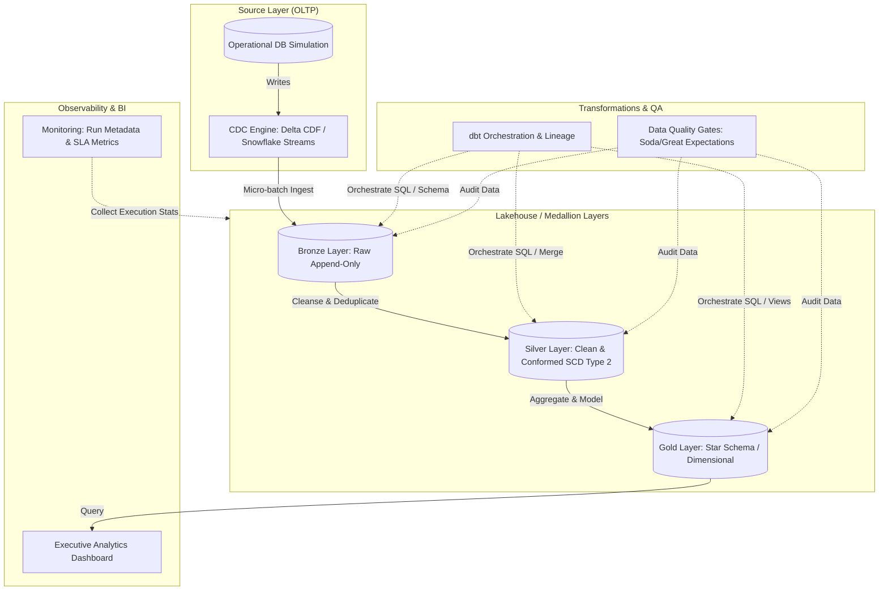
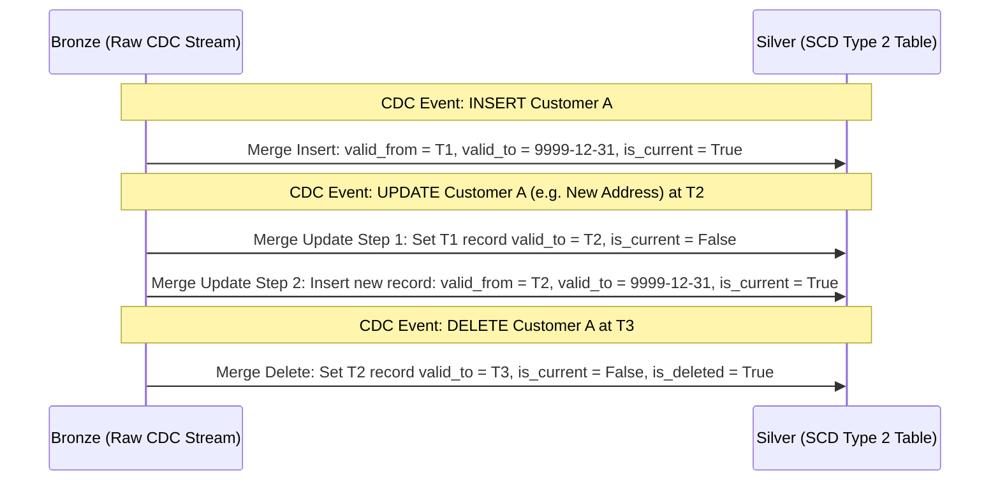

# Enterprise Data Engineering Platform: Architecture

This document describes the high-level design, processing patterns, technology choices, and architectural components of the Enterprise Data Engineering Platform.

---

## High-Level Architecture & Medallion Design

The platform implements the standard Medallion architecture, transforming raw transactional data into conformed, analytical dimensional models using a Change Data Capture (CDC) stream.

---

## Data Flow Details

### 1. Operational Database & CDC Flow
- **Source Database Simulation**: Simulates an OLTP environment (e.g. e-commerce orders, customers, and inventory changes) producing Continuous transaction streams.
- **Change Data Capture (CDC)**:
  - Captures row-level modifications (Inserts, Updates, Deletes) using **Delta Change Data Feed (CDF)** or **Snowflake Streams**.
  - CDC payloads must capture:
    - Primary key of the row.
    - Updated column states.
    - Metadata columns: `_change_type` (`INSERT`, `UPDATE_BEFORE`, `UPDATE_AFTER`, `DELETE`), `_commit_timestamp`, and `_row_sequence_id`.

### 2. Bronze Layer: Raw Historical Append-Only
- Ingests CDC payloads in real-time or frequent micro-batches.
- **No cleaning or transformations** are performed at this layer to guarantee reproducibility of historical states.
- Implements partitioning based on ingestion date (`ingest_date=YYYY-MM-DD`).
- Maintains an audit log of schema changes over time.

### 3. Silver Layer: Conformed & MERGE-based SCD Type 2
- Cleanse raw strings, cast data types, handle missing values, and standardize schemas.
- Translates CDC events into a historically accurate Slowly Changing Dimension (SCD) Type 2 table using standard SQL `MERGE` constructs.
- **SCD Type 2 Lifecycle**:
  - For new records (`INSERT` or `UPDATE_AFTER` with no pre-existing key): Insert the record with `valid_from = _commit_timestamp`, `valid_to = NULL` (or high-date `9999-12-31`), and `is_current = True`.
  - For updated records (`UPDATE_AFTER` where key exists):
    1. Close the current active record by updating its `valid_to = _commit_timestamp` and setting `is_current = False`.
    2. Insert a new active record with `valid_from = _commit_timestamp`, `valid_to = NULL`, and `is_current = True`.
  - For deleted records (`DELETE`): Mark the active record as closed (`valid_to = _commit_timestamp`, `is_current = False`) and optionally flag as `is_deleted = True`.

### 4. Gold Layer: Star Schema / Dimensional Modeling
- Models data for analytical workloads using Kimball dimensional modeling concepts.
- Comprises:
  - **Dimension Tables**: Conformed dimensions derived from Silver tables (e.g. `dim_customers`, `dim_products`).
  - **Fact Tables**: Transaction-oriented tables reference surrogate keys from dimensions (e.g. `fact_sales`).
- Leverages Surrogate Keys (typically generated via deterministic hashing e.g., `MD5` or `SHA256` of natural business keys and `valid_from` timestamps) to handle historical alignment.

---

## Technology Stack

The platform is designed to be compatible with cloud-native modern data stack standards:

| Layer / Capability | Primary Technology | Rationale |
| :--- | :--- | :--- |
| **Simulated Database** | SQLite or PostgreSQL | Easy-to-spin-up relational engines for generating realistic transactional histories. |
| **Change Data Capture**| Delta Lake (CDF) / Snowflake Streams | Industry-standard native change feed extraction. |
| **Storage & Compute**  | Databricks (Spark) or Snowflake | Highly optimized, distributed computation and columnar storage structures. |
| **Transformation**     | dbt (data build tool) | Out-of-the-box support for lineage, testing, model versioning, and documentation. |
| **Data Quality**       | dbt-tests / Soda Core | Declarative data quality constraints check during runtime. |
| **Orchestration**      | Apache Airflow / Prefect / Dagster | DAG-based workflow management with robust retry and logging logic. |
| **Monitoring / BI**    | Grafana / PowerBI (Simulated UI) | Metric visualization for tracking storage sizes, latency, error rates, and key metrics. |

---

## Core Design Principles

1. **Idempotence**: Re-running ingestion or transformation pipelines must yield the same resulting dataset. Raw-to-Bronze and Bronze-to-Silver operations must be deterministic.
2. **Schema Evolution Safety**: Design schemas to handle new optional fields without breaking upstream/downstream integrations.
3. **Data Lineage and Auditability**: Every analytical record in Gold must be traceable back to its raw CDC event in Bronze and operational transaction in the source database.
4. **Decoupled Compute and Storage**: Scale analytical storage independently of compute to manage warehouse costs and scaling limits.
5. **Fail-Fast Quality Gates**: Reject or quarantine records failing hard data-quality validation rules before they reach Silver or Gold layers.
