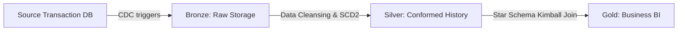

# Medallion Data Platform: Architecture & Technical Overview

This document provides a comprehensive technical guide explaining the Medallion Data Platform, its component layers, and how the data pipeline operates.

---

## 1. What is the Medallion Architecture?
The **Medallion Architecture** is a data design pattern used to organize data logically in a modern lakehouse database. It divides the data processing flow into three conformed layers: **Bronze**, **Silver**, and **Gold**. Each layer progressively improves data structure, quality, and business utility.



### Why Use the Medallion Model?
- **Separation of Concerns**: Decouples raw ingestion from complex analytical transformations.
- **Traceability**: If a bug is found in Downstream processing, data can be rebuilt from the raw Bronze layer without querying the source transactional system again.
- **Single Source of Truth**: Establishes a conformed, historical record (Silver) before aggregates (Gold) are served.

---

## 2. Platform Architecture Layers

### 🔹 Layer 0: Source Transaction Database (OLTP)
- **Database**: [data/source_oltp.db](file:///Users/d-23-10623/Desktop/cdc/data/source_oltp.db)
- **Simulation**: [scripts/db_simulator.py](file:///Users/d-23-10623/Desktop/cdc/scripts/db_simulator.py)
- **Role**: Represents the live, production operational system containing `customers` and `orders` tables.
- **Change Data Capture (CDC)**: Database triggers track all queries (`INSERT`, `UPDATE`, `DELETE`) and write records to a central audit table `cdc_event_log`. This captures the exact state changes (including `UPDATE_BEFORE` values and hard deleted rows) which standard timestamps (`updated_at`) cannot do.

---

### 🔹 Layer 1: Bronze (Raw Append-Only)
- **Database**: Parquet files under `data/bronze/`
- **Simulation**: [scripts/cdc_extractor.py](file:///Users/d-23-10623/Desktop/cdc/scripts/cdc_extractor.py) & [scripts/ingest_bronze.py](file:///Users/d-23-10623/Desktop/cdc/scripts/ingest_bronze.py)
- **Role**: Raw landing area. It copies incoming CDC JSON change feeds, attaches ingestion headers (`_bronze_ingested_at`, `_bronze_batch_id`), segregates entities, and saves them in partitioned **Parquet** folders.
- **Why it's used**: Parquet format provides column-oriented storage, excellent file compression, and fast analytical read speeds.

---

### 🔹 Layer 2: Silver (Conformed Slowly Changing Dimensions)
- **Database**: [data/warehouse.db](file:///Users/d-23-10623/Desktop/cdc/data/warehouse.db) (via [dbt silver models](file:///Users/d-23-10623/Desktop/cdc/transformations/models/marts/))
- **Role**: Data cleansing, deduplication, and historical state keeping.
- **Slowly Changing Dimensions (SCD Type 2)**: For `silver_customers`, the pipeline uses a window function (`LEAD()`) to partition customer records. If a customer updates their address or email, the old record's validity expires (`valid_to` is set to the update timestamp) and a new record is appended.
- **Why it's used**: Captures every historical modification. Standard warehouse updates overwrite values; SCD Type 2 preserves the exact timeline of dimensional states.

---

### 🔹 Layer 3: Gold (Kimball Star Schema)
- **Database**: [data/warehouse.db](file:///Users/d-23-10623/Desktop/cdc/data/warehouse.db) (via [dbt gold models](file:///Users/d-23-10623/Desktop/cdc/transformations/models/marts/))
- **Role**: The Business Intelligence reporting model.
- **Star Schema**: Organized into conformed facts and dimensions:
  - **`dim_customers`**: Unique customer records.
  - **`dim_date`**: Pre-generated calendar table.
  - **`fact_orders`**: Sales transactions.
- **Temporal Join**: To associate an order with the correct customer state, it runs a point-in-time join:
  `orders.created_at >= customer.valid_from AND orders.created_at < customer.valid_to`
- **Why it's used**: Ensures Kimball conformed consistency. If a customer places an order in Illinois, and then moves to California, the old order remains mapped to Illinois for historical tax/sales reports, while new orders link to California.

---

## 3. Data Quality Testing (dbt)
dbt (data build tool) manages compilation, transformations, and testing.

### Native Tests (`transformations/models/schema.yml`)
- **`unique` & `not_null`**: Run on primary surrogate keys (`customer_sk`, `order_id`) to prevent duplicate records or orphaned partitions.
- **`relationships`**: Enforces referential integrity (assures `fact_orders.customer_sk` exists in `dim_customers`).
- **`accepted_values`**: Checks categorical status fields (e.g. `order_status` in Pending, Shipped, Delivered, Cancelled).

### Custom Test (`transformations/tests/assert_order_amount_non_negative.sql`)
- Custom SQL query checking that order prices are non-negative.
- **Why it's used**: Asserts business rule compliance. Any row violating the rule fails the test and blocks downstream propagation.

---

## 4. Platform Observability & Orchestration

### 🔹 Logging metadata ([pipeline_logger.py](file:///Users/d-23-10623/Desktop/cdc/scripts/pipeline_logger.py))
Every task logs execution stats to `monitor_pipeline_runs`:
- `run_id` (UUID) & `pipeline_name`.
- `start_time` & `end_time` (UTC).
- `status` (`SUCCESS`, `FAILED`).
- `error_message` (captures stack traces if a task crashes).

### 🔹 Analytical Views ([create_dashboard_views.sql](file:///Users/d-23-10623/Desktop/cdc/scripts/create_dashboard_views.sql))
- `vw_executive_summary`: Tallies total revenue, order count, and distinct customers.
- `vw_sales_by_state`: Aggregate revenue by customer state code.
- `vw_order_status_breakdown`: Volume split by shipping status.
- `vw_unresolved_orders`: Alert metric tracking orders mapped to "Unknown Customer" (`customer_sk = -1`) due to missing dimensions.

### 🔹 Orchestrator (Docker & Apache Airflow)
- **`Dockerfile`**: Sets up custom Airflow environments with python packages (`pandas`, `pyarrow`, `dbt`).
- **`docker-compose.yml`**: Deploys the multi-service container cluster (Scheduler, Web UI console, Simulator, and Postgres).
- **`pipeline_dag.py`**: Runs task schedules and manages sequential dependencies:
  `CDC Extraction >> Bronze Ingestion >> Bronze to SQLite >> dbt Run >> dbt Test >> Generate Dashboard Data`
- **Dashboard UI**: Responsive dark-themed [index.html](file:///Users/d-23-10623/Desktop/cdc/dashboard/index.html) rendering live KPI indicators, Chart.js graphs, and the platform run execution log history.

---

## 5. Databricks Migration & Integration Guide

If migrating this local sandbox environment to an enterprise **Databricks Lakehouse**, here is how the architectural elements translate:

### 1. Ingestion & Raw Landing (Bronze)
- **Local**: Extract files to `data/cdc_buffer/` and save as Parquet in `data/bronze/`.
- **Databricks**: Use **Databricks Autoloader** (`cloudFiles`) to ingest CDC logs dynamically as they land in a cloud storage bucket (AWS S3, Azure ADLS, or Google Cloud Storage):
  ```python
  spark.readStream \
    .format("cloudFiles") \
    .option("cloudFiles.format", "json") \
    .option("cloudFiles.schemaLocation", "dbfs:/schemas/bronze_customers") \
    .load("s3://your-cdc-bucket/") \
    .writeStream \
    .format("delta") \
    .option("checkpointLocation", "dbfs:/checkpoints/bronze_customers") \
    .table("bronze_customers")
  ```

### 2. Slowly Changing Dimensions (Silver)
- **Local**: Replicate window functions in SQLite.
- **Databricks**: Enable **Delta Change Data Feed (CDF)** on Silver tables to automatically record updates. Apply native **Delta Merge** operations directly in PySpark or SQL.

### 3. dbt on Databricks SQL
- **Local**: `dbt-sqlite` adapter.
- **Databricks**: Install `dbt-databricks` and connect to a serverless **Databricks SQL Warehouse** in `profiles.yml` using personal access tokens:
  ```yaml
  transformations:
    target: dev
    outputs:
      dev:
        type: databricks
        catalog: hive_metastore # or Unity Catalog
        schema: main
        host: <databricks-workspace-url>
        http_path: /sql/1.0/warehouses/<warehouse-id>
        token: "{{ env_var('DBT_DATABRICKS_TOKEN') }}"
  ```

### 4. Orchestration
- **Local**: docker-compose running Airflow.
- **Databricks**: Use **Databricks Workflows** (Jobs UI) to orchestrate notebooks, dbt tasks, and Spark jars with visual dependency maps, or trigger Databricks jobs via **Airflow Databricks Operators** (`DatabricksSubmitRunOperator`).
